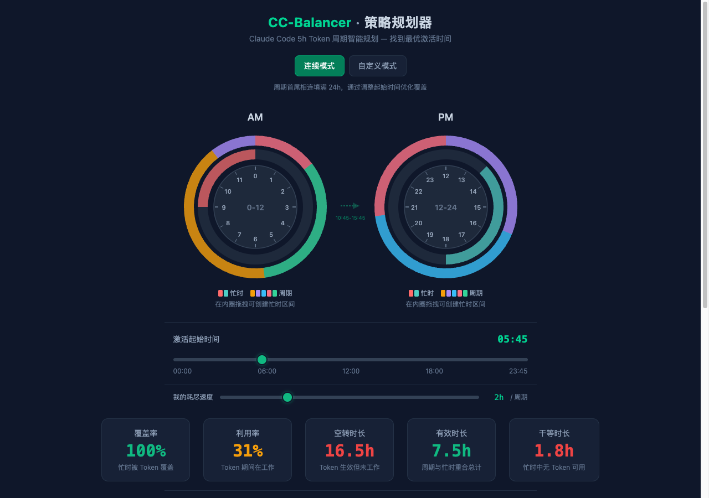
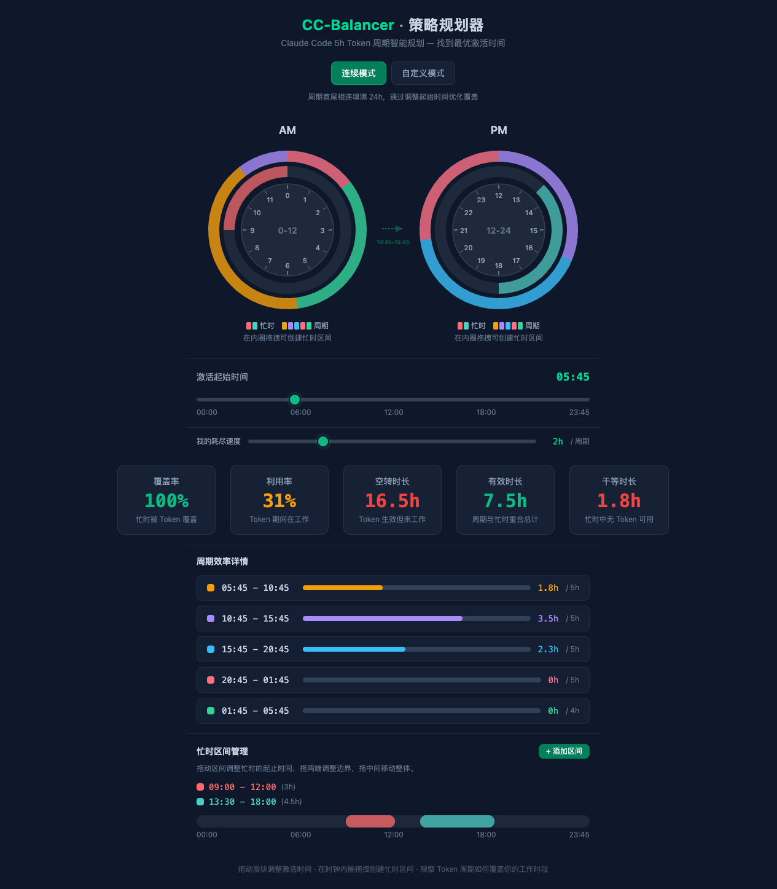

# CC-Balancer · 策略规划器

> Claude Code 5h Token 周期智能规划 — 找到最优激活时间，最大化你的编码产出。



## 为什么需要它？

Claude Code 的 Token 每 **5 小时**自动刷新一次。如果激活时间没规划好，可能出现：

- 工作正酣时 Token 耗尽，只能干等
- Token 充足时你在休息，白白浪费
- 多个周期的有效利用率参差不齐

**CC-Balancer** 通过可视化时钟 + 实时指标，帮你找到最优的 Token 激活策略。

## 功能特性

### 双模式规划

| 模式 | 说明 | 适用场景 |
|------|------|----------|
| **连续模式** | 5h 周期首尾相连填满 24h，调整起始时间优化覆盖 | 作息规律、全天候工作 |
| **自定义模式** | 自由放置多个 5h 周期，闲时跳过不浪费 | 灵活作息、集中工作 |


### 交互式双时钟

- **AM / PM 时钟**直观展示 Token 周期与忙时的覆盖关系
- 在时钟**内圈拖拽**即可创建忙时区间（15 分钟对齐）
- 跨时段的周期通过**连接线**标注，一眼看清全貌

### 五维指标面板

| 指标 | 含义 |
|------|------|
| **覆盖率** | 忙时被 Token 覆盖的百分比 |
| **利用率** | Token 生效期间你在工作的百分比 |
| **空转时长** | Token 生效但你未工作的时长 |
| **有效时长** | 周期与忙时重合的总时长 |
| **干等时长** | 你在工作但 Token 已耗尽的时长 |

### 更多能力

- **耗尽速度调节** — 根据你的实际用量（1h-5h/周期）精确建模
- **忙时区间管理** — 拖拽两端调整边界，拖中间整体平移
- **周期效率详情** — 查看每个周期与忙时的重合比例
- **碰撞检测** — 自动防止忙时区间和周期之间的重叠

## 快速开始

```bash
# 安装依赖
pnpm install

# 启动开发服务器
pnpm dev

# 构建生产版本
pnpm build
```

打开 `http://localhost:5173` 即可使用。

## 技术栈

- **React 19** + **TypeScript 5.9**
- **Vite 7** 构建
- **Tailwind CSS 4** 深色主题
- 零运行时依赖，纯前端应用

## 项目结构

```
src/
├── App.tsx                     # 主容器，模式切换与状态管理
├── components/
│   ├── ClockFace.tsx           # 双时钟可视化（SVG 交互）
│   ├── StartTimeSlider.tsx     # 连续模式 - 激活时间滑块
│   ├── CycleStartManager.tsx   # 自定义模式 - 多周期管理
│   ├── TimeSlotManager.tsx     # 忙时区间编辑
│   ├── MetricsPanel.tsx        # 五维指标面板
│   ├── CycleDetailsPanel.tsx   # 周期效率明细
│   └── CycleBridge.tsx         # 跨时段连接指示
└── utils/
    ├── time.ts                 # 时间计算引擎（核心算法）
    └── colors.ts               # 周期色彩常量
```

## 完整界面预览



## License

MIT
